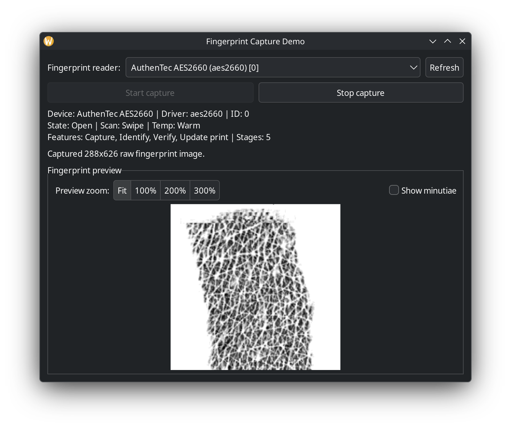

# fprint-demo-gtk

A small GTK application for interacting with fingerprint devices using libfprint 2. It enumerates available devices, opens a selected reader, and captures repeated raw fingerprint images for preview and inspection.

## Features

- Lists compatible fingerprint devices found by libfprint
- Shows device metadata such as name, driver, scan type, and capabilities
- Captures raw fingerprint images repeatedly from the selected device
- Displays the preview in a GTK window
- Optional minutiae overlay for inspecting fingerprint features
- Suggests a matching udev rule for device permissions

## Requirements

- GTK 3 development libraries
- libfprint 2 development libraries
- GCC and Make
- A supported fingerprint sensor exposed through libfprint

On Debian/Ubuntu-based systems, install dependencies with:

```bash
sudo apt update
sudo apt install build-essential libgtk-3-dev libfprint-2-dev
```

## Compatibility
* This project provides a GTK3-based fingerprint image viewer for libfprint 2.x,
  to replace the `fprint-demo` tool that libfprint 1.x included.
* This project was created against the library versions in Ubuntu 26.04:
  - `pkg-config --modversion gtk+-3.0` says: `3.24.52`
  - `pkg-config --modversion libfprint-2` says: `1.95.1+tod1`
* The code may need adjusting if used against older or newer versions of libfprint.

## Notes

* The application expects a compatible libfprint-supported fingerprint reader to be available.
* If the device is not accessible, it may suggest a udev rule to add to grant permissions.
* This project was designed for two reasons:
  - To investigate fingerprint-capture quality and factors affecting fingerprint reliability
  - To gain practical experience with AI-assisted software development using GitHub Copilot

## Build

From the project directory:

```bash
make
```

This builds the binary named `fprint-demo-gtk`.

## Run

```bash
./fprint-demo-gtk
```

## Screenshot

Example capture from the application. The sample shown here was captured from a non-biometric surface for privacy and demonstration purposes.



## License

This project is licensed under the MIT License. See the [LICENSE](LICENSE) file for the full text.

Copyright (c) 2026 Dana Goyette.

